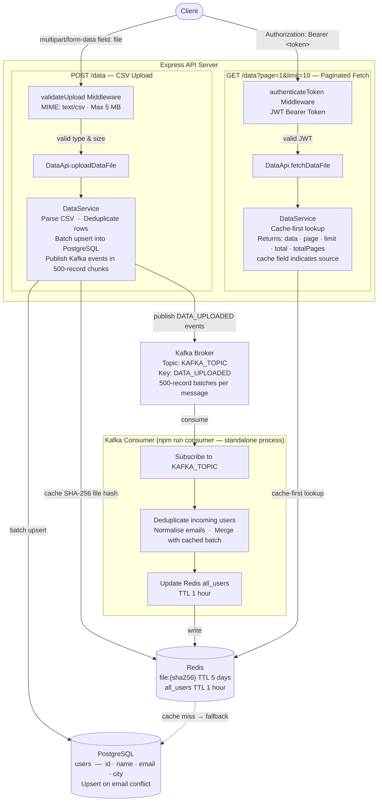

# A backend system with postgres, redis and kafka

This repository contains an Express+TypeScript backend service with Postgres, Redis, Kafka integration. All infrastructure runs locally via Docker Compose.

## Tech Stack
* Nodejs
* PostgreSql
* Redis
* Kafka
* Docker


## Prerequisites

- Docker & Docker Compose installed
- Node.js (>= 18) and npm

## Getting Started

1. **Copy environment file**

    ```bash
    cp .env.example .env
    ```

    Update with your values.
    Usually if one or more services are runing in the host system, the default port may not work, in that case give different port.

    > Eg: 5433 instead of 5432 as postgres port.

2. **Start infrastructure**

    ```bash
    docker-compose up -d
    ```

    This will bring up PostgreSQL, Redis, Zookeeper, and Kafka.

3. **Install dependencies**

    ```bash
    npm install
    ```

4. **Run the API server**

    ```bash
    npm run start
    ```

    The Node process will load variables from `.env` (via `dotenv`).

5. **Run the Kafka consumer**
    ```bash
    npm run consumer
    ```
    This is a separate process and also reads `.env`.

6. **Run the tests**
    ```bash
    npm run test
    npm run test:coverage # for coverage report
    ```
    This is a separate process and also reads `.env`.

7. **Stop docker**

    ```bash
    docker-compose down
    ```


## Environment Variables

Configuration is entirely driven by environment variables:

- `PG_USER` – PostgreSQL user
- `PG_PASSWORD` – PostgreSQL password
- `PG_DB` – PostgreSQL database name
- `PG_HOST` – PostgreSQL host
- `PG_PORT` – PostgreSQL port

- `REDIS_HOST` – Redis connection host url without port
- `REDIS_PORT` – Redis port

- `KAFKA_TOPIC` – Kafka topic for sending upload data event
- `KAFKA_PORT` – Kafka port
- `KAFKA_BROKERS_HOST` – host for the kafka broker (we are working with one broker in this sample)
- `PORT` – port for the Express server
- `JWT_SECRET` – secret key used to sign and verify JWT tokens (defaults to `dev-secret` locally)


## API Endpoints

- `POST /data` – upload CSV file (multer `file` field; must be `text/csv`, max 5 MB)
- `GET /data?page=1&limit=10` – fetch paginated entries (requires `Authorization: Bearer <token>`)

## Components
1. <u>Upload API</u>


* Accept a CSV file via a REST endpoint
* Validate and process the file contents
* Persist the data into a PostgreSQL database
* After saving, publish an event to a Kafka topic
* Return a structured success or error response


2. <u>Fetch API</u>

* Expose a REST endpoint to retrieve all records
* Serve from Redis cache where available
* Handle cache unavailability gracefully with a fallback strategy

3. <u>Kafka Consumer Service</u>
* Run as a standalone Node.js process separate from the API
* Listen to the Kafka topic published by the Upload API
* On each message, update the Redis cache
* Handle failures, retries, and duplicate messages
* Log meaningful output for each event processed

## Architecture



## Notes

- Kafka events are published on upload and consumed by a standalone service
- Redis is used for caching and updated by the consumer
- All configuration defaults are safe for local development
- The fetch endpoint is protected with JWT Bearer token authentication
- The upload endpoint validates file type and size with Joi before processing

